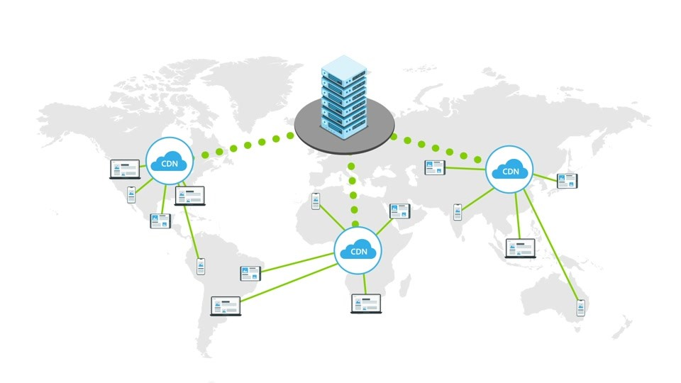

# CDN

Un CDN (content delivery network) est un système international de serveurs reliés entre eux afin de fournir du contenu à partir d'un endroit aussi proche que possible de l'utilisateur final.

<figure><figcaption>
<a href="https://learn.microsoft.com/en-us/power-pages/configure/configure-cdn">Source</a>
</figcaption></figure>

Par exemple, lorsque Netflix diffuse une vidéo sur votre iPad, il serait préférable que la source du flux se trouve en France plutôt que de l'autre côté de l'Atlantique.

Pourquoi ?

* réduction de la latence (le temps que mettent les paquets vidéo à arriver sur votre iPad)
* réduction des coûts (l'utilisation d'un câble transatlantique peut être coûteuse pour les fournisseurs de services)

Typiquement, cela fonctionne comme suit :

* Vous téléchargez votre contenu vers l'interface CDN de votre fournisseur.
* Le fournisseur copiera automatiquement le contenu sur des serveurs situés aux endroits que vous préférez (soit de manière préemptive, soit à la demande) - Lorsqu'un utilisateur demande un fichier, la requête sera dirigée vers le serveur le plus proche géographiquement

## Vocabulaire

| Fournisseur | Terme                |
| ----------- | -------------------- |
| AWS         | CloudFront           |
| Azure       | Front Door / CDN     |
| GCP         | Cloud CDN            |
| OVH         |                      |
| Scaleway    | Edge Services (beta) |
