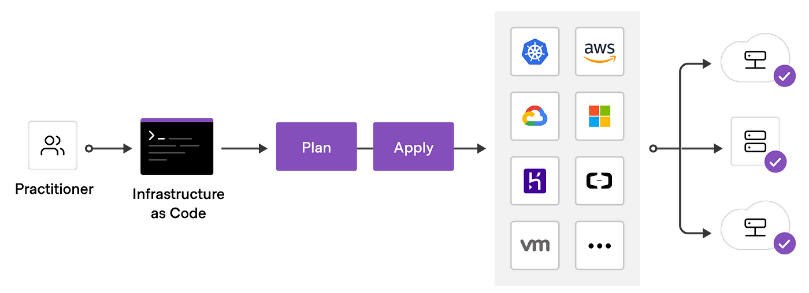

# Terraform

Les outils d'orchestration tels que Kubernetes peuvent faire tourner des VM et des répartiteurs de charge, mais ils gèrent surtout les processus : où ils s'exécutent, gestion des pannes, mise à l'échelle.

Dans le même esprit, certains fournisseurs de IaaS ont la possibilité de fournir une spécification lisible par machine de l'architecture souhaitée :

* les VM à configurer
* les volumes
* la configuration du réseau privé / public
* les passerelles
* les bases de données
* ...

Généralement, nous effectuons ces actions manuellement via le site web du fournisseur. Certains fournissent également des outils de ligne de commande qui nous permettent de créer des ressources par le biais d'une commande.

Terraform est une spécification pour **Infrastracture as Code** qui nous permet de spécifier l'infrastructure souhaitée, et le fournisseur essaiera automatiquement de satisfaire cette infrastructure pour nous.

Le principal avantage de Terraform est qu'il standardise la création de ressources à travers les fournisseurs de cloud supportés, réduisant ainsi notre dépendance ou le risque de "lock-in".

<figure><figcaption>
<a href="https://medium.com/nerd-for-tech/nfrastructure-as-code-using-terraform-cb383017cbeb">Source</a>
</figcaption></figure>
