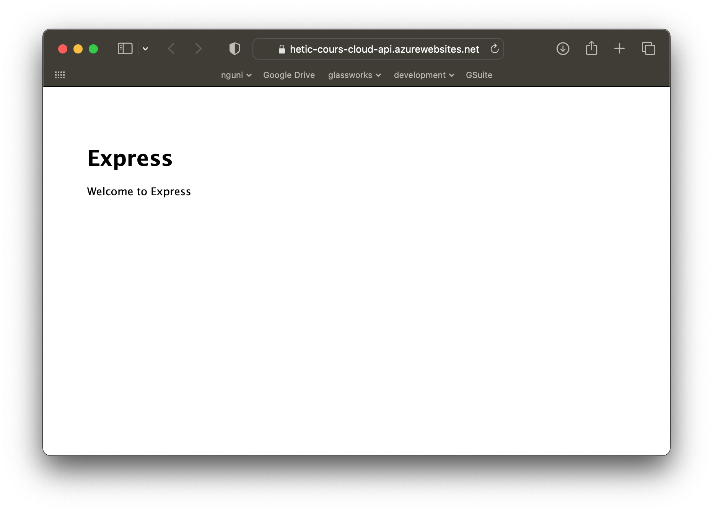
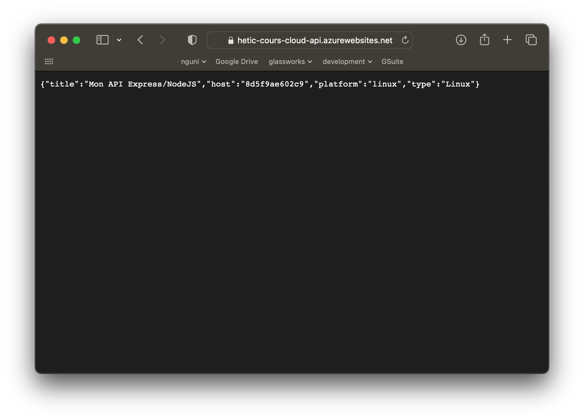

# Evaluation

Vous serez évalué sur votre utilisation des services cloud pour déployer une application web fonctionnelle, tout en utilisant un fournisseur Cloud.

L'exercice se fait au fur et à mesure. Vous validez chaque exercice avec l'intervenant avant de continuer avec le suivant. Vous avez jusqu'à demain soir 17h pour valider toutes les exercices.

## Etude de cas

Une entreprise souhaite déployer rapidement un site web dynamique connecté à une base de données.

Vous avez des développeurs dans l'entreprise (NodeJS), mais pas forcément la connaissance des architectures de production.

Vous avez entendu dire qu'il existe des services Cloud qui exécutent le code, sans qu'il soit nécessaire de configurer les serveurs, le réseau, etc. En particulier, Microsoft Azure a une offre appelée "App Services" qui nous permet de pousser notre code NodeJS directement dans le Cloud, et de le déployer automatiquement.


## Exercice 1 (8 points)

Heureusement, il existe des tutoriels qui expliquent comment mettre en place un projet NodeJS de base et le déployer dans le nuage Azure.

[Tutoriel NodeJS - Azure Cloude](https://learn.microsoft.com/en-us/azure/app-service/quickstart-nodejs?tabs=linux&pivots=development-environment-vscode#deploy-to-azure)

Suivez le tutoriel et déployez votre première version fonctionnelle sur le cloud.

Prérequis :

- Installez NodeJs sur votre machine locale : [https://nodejs.org](https://nodejs.org)
- Installez VSCode sur votre machine locale : [https://code.visualstudio.com](https://code.visualstudio.com)
- Une fois VSCode installé, ajoutez l'extension  `Azure App Service Extension`.

Une fois fonctionnel, montrez votre application fonctionnel à l'intervenant pour valider votre travail. Il faut montrez la page déployé dans un navigateur, ainsi que le projet configuré dans le panneau de contrôle Azure :

<figure></figure>

## Exercice 2 (4 points)

Nous aimerions tester le processus de développement. Ajouter un nouveau point d'accès à l'application Express :

En haut du fichier, ajoutez la ligne suivante :

```js
...
var cookieParser = require('cookie-parser');
var logger = require('morgan');

// Ajoutez la ligne suivant :
var os = require('os');

...
```

Ensuite, ajoutez une nouvelle route pour une requête HTTP type `GET` qui s'appelle `/info` :

```js
...
app.use('/', indexRouter);
app.use('/users', usersRouter);

// Ajouter le bloque suivant 
app.get('/info', (req, res) => {
  res.json({
    title: "Mon API Express/NodeJS",
    host: os.hostname(),
    platform: os.platform(),
    type: os.type()
  });
})
```

Re-déployez votre application, et la valider auprès de l'intervenant, en lui montrant la route `/info` dans le navigateur :

<figure></figure>


## Exercice 3 (2 points)

Lors du déploiement dans un nuage, nous devons souvent fournir des secrets qui ne doivent pas être directement écrits dans notre code. Il s'agit généralement d'informations telles que le mot de passe d'une base de données.

En NodeJS, nous utilisons des variables d'environnement dans notre code, qui sont disponibles via la variable `process.env.VARIABLE_NAME`. Par exemple :


```js
app.get('/info', (req, res) => {
  res.json({
    title: "Mon API Express/NodeJS",
    host: os.hostname(),
    platform: os.platform(),
    type: os.type(),
    // Ajouter la ligne suivante
    mySecret: process.env.MY_SECRET
  });
})
```

Nous fournissons des valeurs pour ces variables au fournisseur Cloud. Lors de l'exécution de notre code, le fournisseur fournira automatiquement ces variables.

Dans le panneau de contrôle Azure, trouvez l'onglet Variables et définissez une valeur pour `MY_SECRET`. 

Déployez une nouvelle version de votre application qui montre votre secret dans le point de terminaison `/info`, et validez le résultat avec l'intervenant.

## Exercice 4 (5 points)

Nous voulons maintenant connecter notre application à une base de données.

Tout d'abord, provisionnez une base de données MySQL sur Azure Cloud (cherchez **"Serveur Flexibles Azure Database pour MySQL"**). Utilisez les informations et les compétences que vous avez acquises jusqu'à présent pour accomplir cette tâche.


Une fois l'opération terminée, accédez à l'interface d'administration de la base de données.

Naviguez dans le menu "Base de données", et ajoutez une base qui s'appelle `demo`. 

Naviguez dans le menu "Mise en Réseau" : 

- Téléchargez le certificat SSL, et coller le fichier à la racine de votre projet NodeJS (à coté de `app.js`). Le fichier devrait s'appeler `DigiCertGlobalRootCA.crt.pem`
- Cochez la case **Autoriser l'accès public à cette ressource via Internet en utilisant une adresse IP publique**
- Cochez la case **Autoriser l'accès public à partir d'un service Azure dans Azure sur ce serveur**
- Cliquez sur le lien **Ajouter une adresse IP cliente actuelle**


Sur votre ordinateur local, ajoutez le package `mysql2` qui sert à communiquer avec une base de données :

```bash
# A executer dans le terminal, à la racine de votre projet
npm install --save mysql2
```

Modifiez le code en ajoutant un `require` au début de votre projet :

```js
var mysql = require('mysql2/promise');
var fs = require('fs');
```

Créez un objet de connexion (collez le suivant juste après le `requires`):

```js
const config = {
  host: 'REMPLACER AVEC ADRESSE DE VOTRE HOTE',
  user: 'REMPLACER AVEC LE NOM UTILISATEUR QUE VOUS AVEZ CONFIGURÉ'
  database: 'demo', 
  port: 3306,
  password: 'REMPLACER AVEC VOTRE MOT DE PASSE',
  ssl:{ca:fs.readFileSync('./DigiCertGlobalRootCA.crt.pem')}
}
```

Ajoutez la requête `/init` :

```js
app.get('/init', async (req, res) => {
  try {
    const connection = await mysql.createConnection(config);

    let sql = "CREATE TABLE IF NOT EXISTS app_user (userId int not null,email varchar(256) unique not null,familyName varchar(256),givenName varchar(256), balance int default 0, primary key(userId))";
    await connection.query(sql);

    sql ="insert into app_user (userId, email, familyName, givenName) values (1, 'bob@builder.com', 'Builder', 'Bob'),(2, 'suzy@cue.com', 'Cue', 'Suzy'),(3, 'john@doe.com', 'John', 'Doe')";
    await connection.query(sql);

    const [rows, fields] = await connection.query(sql);

    connection.close();

    res.json({
      done: true
    })

  } catch (err) {
    
    res.json({
      ok: false,
      code: err.code,
      message: err.message,
      sql: err.sql
    })
  }

})
```

Lancez votre API en local avec `DEBUG=myexpressapp:* npm start`. Dans votre navigateur, vous devez naviguer à [localhost:3000/init](localhost:3000/init). Ce lien, si tout fonctionne va créer des données dans la base de données

Ajoutez la requête `/info` :

```js
app.get('/list', async (req, res) => {

  try {
    const connection = await mysql.createConnection(config);

    const sql = 'SELECT * FROM `app_user`';

    const [rows, fields] = await connection.query(sql);

    connection.close();

    res.json(rows)
  } catch (err) {
    console.log(err);
    res.json({
      ok: false
    })
  }

})
```

Relancez votre serveur local, et naviguez à [http://localhost:3000/list](http://localhost:3000/list). Vous verrez vos données !

Déployez votre application, et montrez le endpoint `/list` à l'intervenant, ainsi que la configuration sur Azure.

Seriez-vous capable de modifiez l'objet de configuration pour utiliser plutôt des variables d'environnement, au lieu d'utiliser les valeurs directement dans le code ?

## Exercice 5 (1 point)

Supprimez toutes les ressources sur Azure que vous avez crée, afin de ne pas dépenser votre crédit. Valider auprès de l'intervenant.