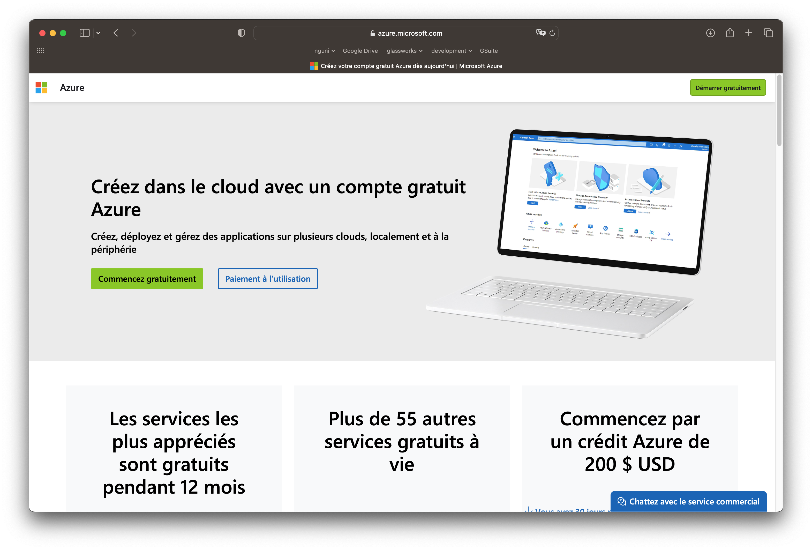
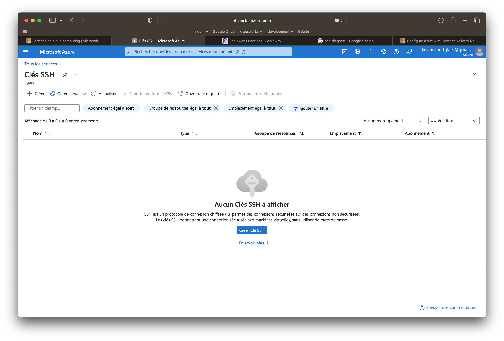
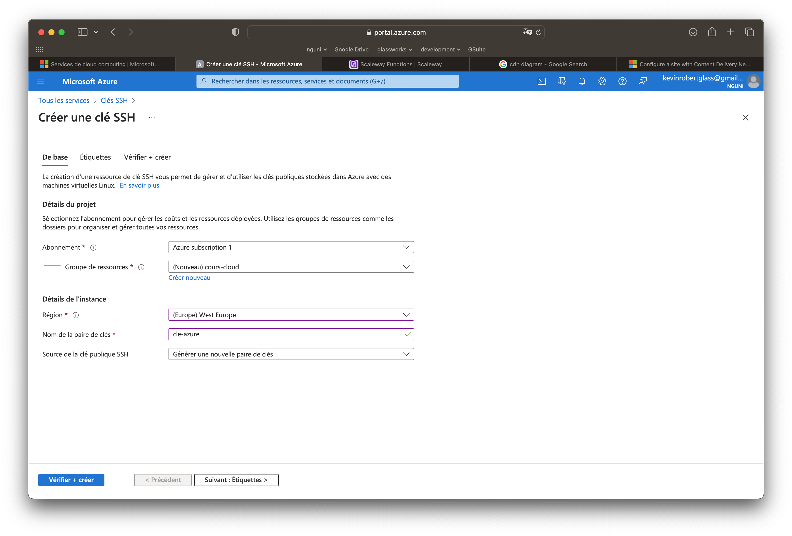
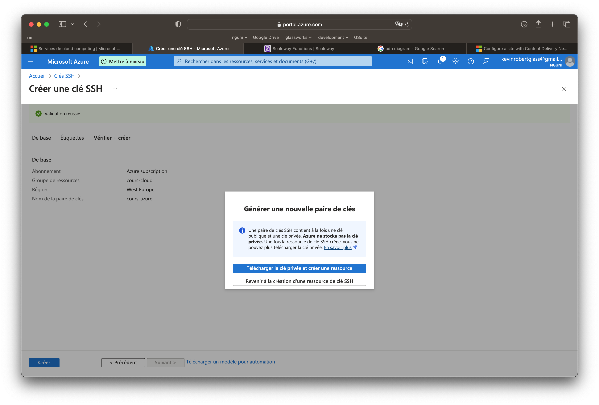

# Azure

Pour la partie pratique de ce cours, nous provisionnerons et utiliserons des ressources sur un fournisseur de Cloud.

Vous pouvez utiliser le fournisseur de votre choix. Cependant, la plupart d'entre eux demandent une carte de crédit pour se connecter.

La seule exception est Microsoft Azure, qui propose une licence étudiante. 

<figure><figcaption>
Azure
</figcaption></figure>

Naviguez vers [https://azure.microsoft.com/fr-fr/](https://azure.microsoft.com/fr-fr/).

Choisissez l'option de démarrage gratuit et suivez les étapes. **Veillez à utiliser votre adresse électronique d'étudiant (HETIC ou Galiléo)**.

Vous devriez recevoir 100€ de ressources gratuites.

## Clés SSH

Afin de vous identifier sur les ressources créées par Azure (ou sur n'importe quel fournisseur), vous devez créer une paire de clés SSH.

Une clé SSH est composée de deux parties : 
- une clé privée, que vous gardez pour vous et ne partagez jamais
- une clé publique, qui est mathématiquement liée à la clé privée.

Nous pouvons générer les clés nous-mêmes (en utilisant Putty sous Windows, ou `ssh-keygen` sous Linux ou MacOS). Mais Azure dispose d'un outil qui nous permet de le faire.

Dans la barre de recherche, tapez " clé ssh ".

<figure></figure>

Cliquez sur "Créer Clé SSH".

<figure></figure>

Remplissez le formulaire comme dans l'image dessus. Clicker sur "Suivant", puis "Créer".

<figure></figure>

Confirmer la création. Ensuite, cliquer sur "Télécharger la clé privée et crée une ressource".

La **clé privée** se télécharge sur votre machine. Il faut la garder précieusement !

