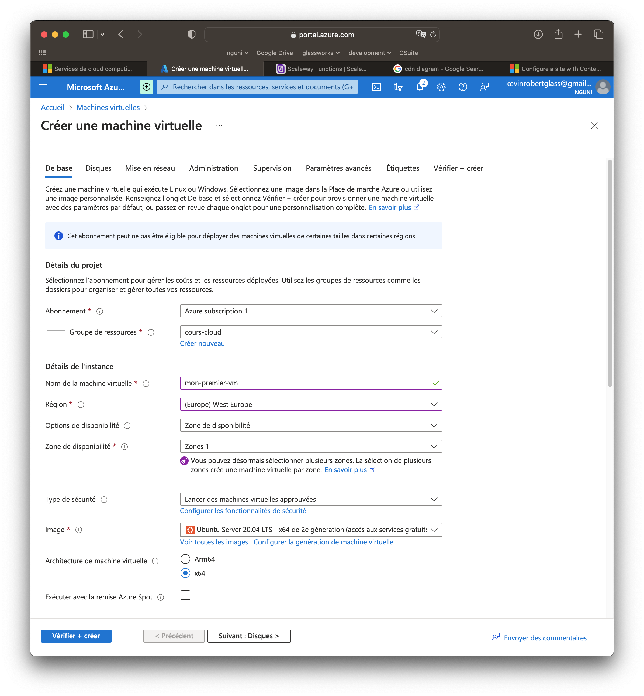
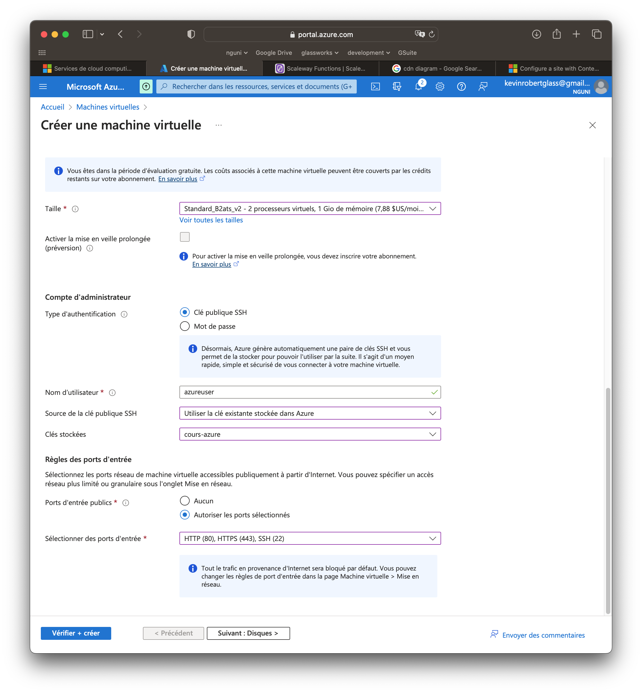
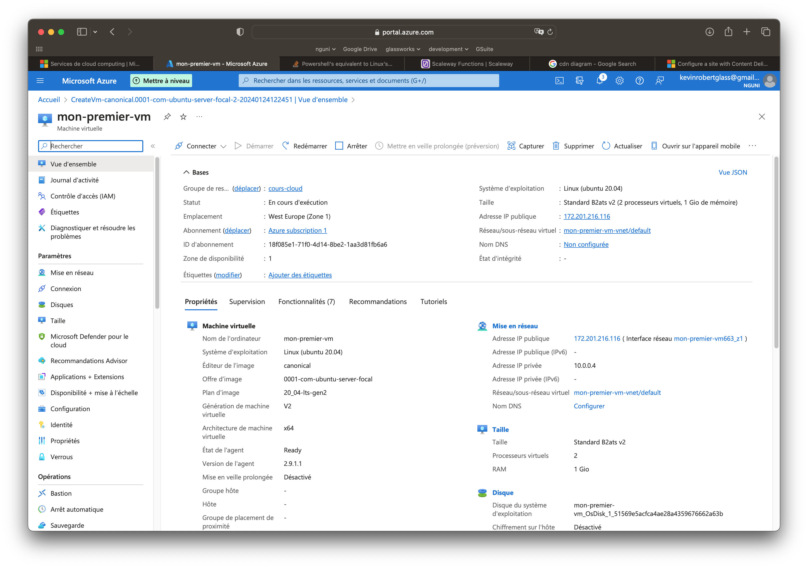
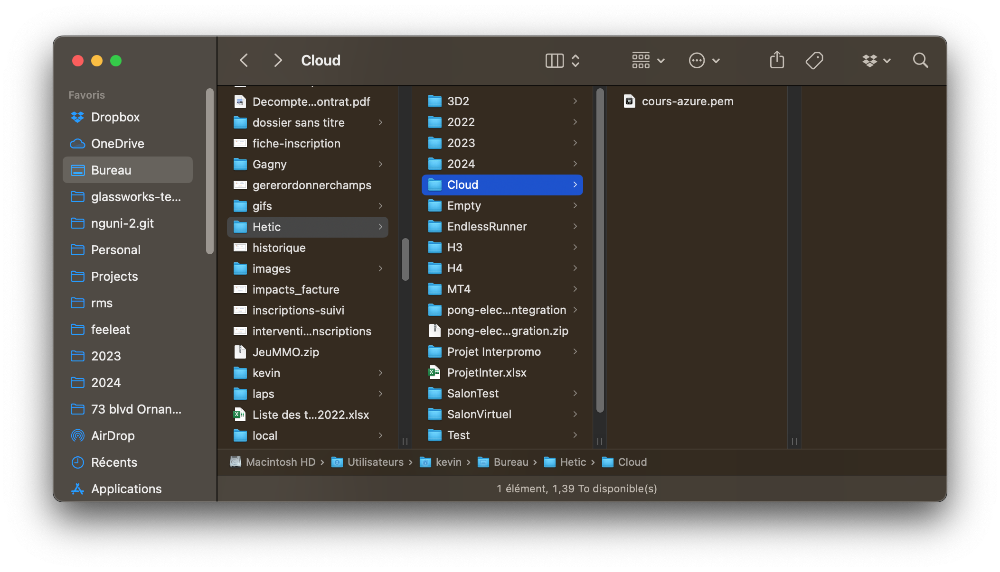
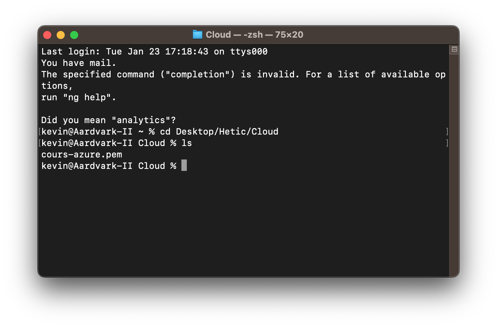
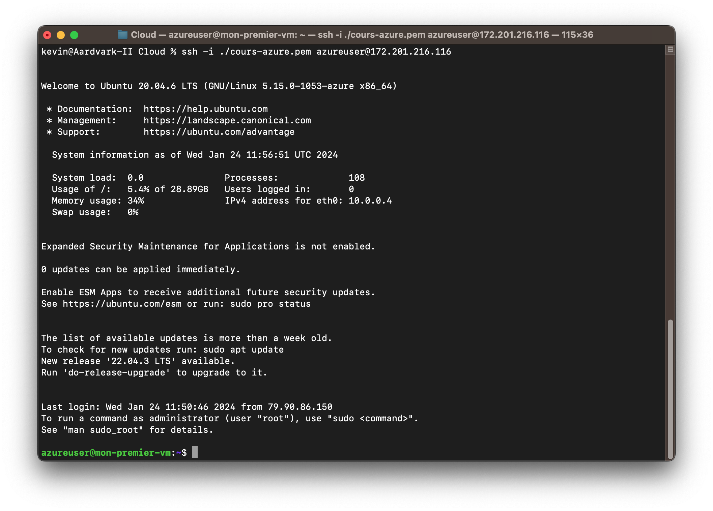
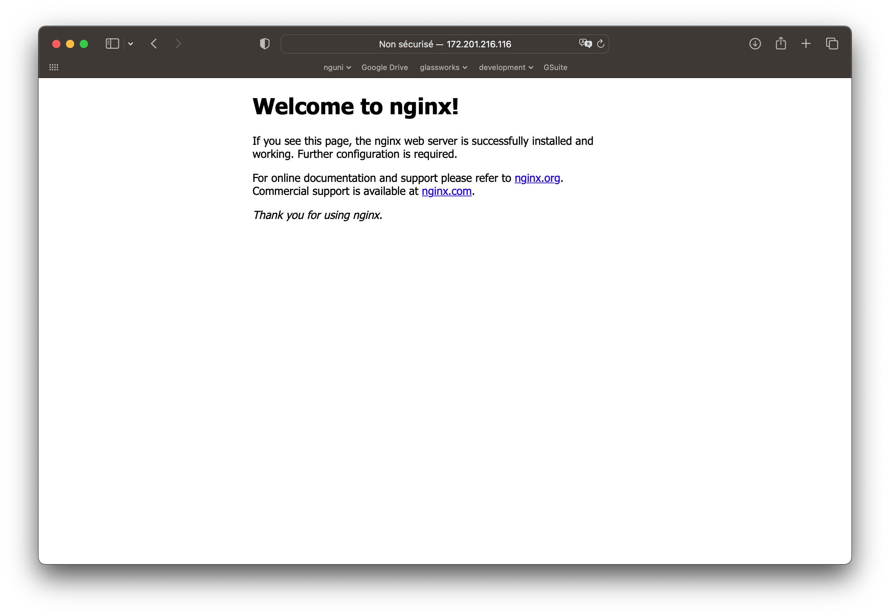

# Création d'une VM

Nous allons maintenant provisionner notre première VM.

Cliquer sur "Machine Virtuelles" et lancer le processus de création.

<figure><figcaption></figcaption></figure>

Dans le formulaire, préciser :

* Le même groupe de ressources que vous avez crée pour la clé ssh
* La même région
* Système d'exploitation: Ubuntu Server 20.04
* Architecture x64

<figure><figcaption></figcaption></figure>

Choisissons la puissance de la VM. Prenez l'option "Standard\_BTats\_V2 - 2 processeurs virtuels, 1 Go de mémoire" (le moins cher). Il se trouve qu'il faut cliquer sur "Toutes les tailles" et aller chercher le modèle.

Pour le compte administrateur, cochez l'option "Clé publique SSH".

Dans "Source de la clé publique SSH", sélectionnez "Utiliser la clé existante dans Azure".

Dans "Clés stockées" sélectionnez la clé qu'on a crée juste avant dans la liste.

Dans les ports d'entrée publics, sélectionnez HTTP, HTTPS et SSH.

Ensuite, cliquer sur "Suivant". Nous allons laisser les paramètres de base :

* un volume sera associé
* la mise en réseau de base sera effectué
* ...
* jusqu'au "Véfirier et créer"

Cliquer sur le bouton "Créer".

Attendez la création de votre VM, puis cliquez sur "Accéder à la ressource". Vous serez présenté avec un panneau de contrôle avec les détails sur votre VM.

<figure><figcaption></figcaption></figure>

Prenez note surtout de **l'adresse IP publique**.

## Connectez-vous à votre VM

Nous nous connectons à l'aide d'un shell sécurisé (SSH) qui ouvre une interface de ligne de commande vers notre VM. Pour ce faire, nous utiliserons la clé privée que nous avons créée précédemment.

Précédemment, vous avez téléchargé la clé privée créée par Azure. Copiez cette clé dans un répertoire de travail pratique, par exemple :

```
Desktop/Hetic/Cloud/
```

<figure><figcaption></figcaption></figure>

Sous MacOS ou Linux, vous devez ouvrir un nouveau **Terminal**.

Sous Windows, vous devez ouvrir PowerShell.

Dans le shell, naviguez dans le répertoire de ci-dessus :

```bash
cd Desktop/Hetic/Cloud/
```

<figure><figcaption></figcaption></figure>

Vérifier que dans ce dossier se trouve votre clé privée :

```bash
ls
```

Vous devriez voir un listing de votre fichier.

Maintenant, créons une connexion SSH :

```bash
# Remplacez "cours-azure.pem" par le nom de votre clé privée
# Remplacez "172.201.216.116" par l'adresse IP que vous avez noté sur le tableau de bord Azure
ssh -i ./cours-azure.pem azureuser@172.201.216.116
```

Vous verrez un message de bienvenu, ainsi qu'un réplique qui est différent. Vous êtes maintenant connecté à votre VM !

<figure><figcaption></figcaption></figure>


Si vous avez un message d'erreur concernant les permissions de votre cle, vous devez sécuriser la clé privée (une seule fois).

Sur Linux/MacOS :

```bash
# Remplacez "cours-azure.pem" par le nom de votre clé privée
chmod 600 ./cours-azure.pem 
```

Sur Windows :

```bash
# Remplacez "cours-azure.pem" par le nom de votre clé privée
icacls .\cours-azure.pem /inheritance:r
icacls .\cours-azure.pem /grant:r "%username%":"(R)"

# Ou dans PowerShell
icacls .\cours-azure.pem /inheritance:r
start-process "icacls.exe" -ArgumentList '.\cours-azure.pem /grant:r "$env:USERNAME":"(R)"'
```


Venez me voir si vous avez des problèmes concernant la lecture de votre clé !


## Installer un web-serveur

Maintenant que nous sommes connectés à notre VM, nous pouvons l'utiliser pour ce que nous voulons !

C'est juste une machine Linux, alors exécutons quelques instructions pour installer un serveur web (`nginx`).

```bash
# Mise à jour des paquets
sudo apt update

# Installer nginx
sudo apt install nginx
```

Le serveur web est désormais disponible, et on peut l'acceder d'un navigateur. Ouvrez un navigateur (Chrome, Firefox, ...), et coller l'adresse IP de votre VM :

<figure><figcaption></figcaption></figure>

## Evaluation 1

Veuillez suivre les étapes ci-dessus pour créer une VM, y accéder par SSH et installer un serveur web.

Une fois prêt, veuillez le montrer à l'intervenant qui validera cette note pour évaluation. Spécifiquement :

* Montrez la page de configuration de la VM sur Azure (ou un fournisseur comparable), en particulier l'adresse IP.
* Démontrer une connexion SSH à la VM
* Ouvrez un navigateur et montrez la page d'accueil de nginx en utilisant la même adresse IP de la VM.

## Evaluation 2

Supprimez toutes les ressources associées à votre VM :

* La VM
* L'adresse IP
* Les volumes&#x20;

Montrer à l'intervenant que tout a été supprimé pour valider cette tâche pour évaluation.
